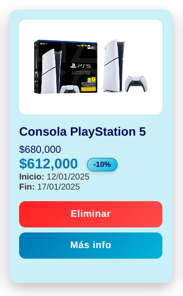

# 🛒 Subastas Web – Aplicación Angular

Aplicación web desarrollada en **Angular** que permite gestionar y visualizar subastas de productos.  
Incluye listado dinámico de productos, uso de **pipes estándar y personalizados**, formulario reactivo de contacto y una interfaz moderna basada en una paleta de colores definida.

---

## 📌 Descripción del proyecto

Este proyecto consiste en una aplicación de subastas donde el usuario puede:

- Visualizar una lista de productos en subasta.
- Ver precios formateados mediante **pipes estándar** (`currency`, `date`).
- Aplicar un **pipe personalizado de descuento** sobre las ofertas.
- Interactuar con un formulario reactivo para contacto.
- Agregar y eliminar productos de forma dinámica.
- Navegar suavemente entre secciones mediante scroll animado.

El objetivo principal es afianzar conceptos de **Angular**, componentes, pipes, formularios reactivos y buenas prácticas de UI.

---

## 🛠️ Instalación y ejecución

### 1. Clonar el repositorio
git clone https://github.com/SchallerFran/subastas-web

### 2. Instalar dependencias
npm install

### 3. Ejecutar el servidor de desarrollo
ng serve

Luego abrir en el navegador:  
http://localhost:4200

---

## 🖼️ Capturas de pantalla

> 📷 Las capturas se encuentran en la carpeta `/screenshots` del proyecto.

### 📦 Lista de productos cargada

### 🔧 Aplicación de pipes estándar
Se aplican los siguientes pipes:
- `currency` para el formato de precios.
- `date` para fechas de inicio y fin de las subastas.

### 🎉 Pipe personalizado – Descuento
El **pipe personalizado de descuento**, aplica sobre el precio de la oferta un descuento y se muestran en pantalla el precio de la oferta con y sin descuento.

### 📝 Formulario – Agregar y eliminar productos
Al seleccionar `simular agregar producto` se genera una subasta nueva predefinida.

---

## 👤 Autor
- **Francisco Schaller**
- Curso Desarrollo con Angular
- Unidad Nro. 3
